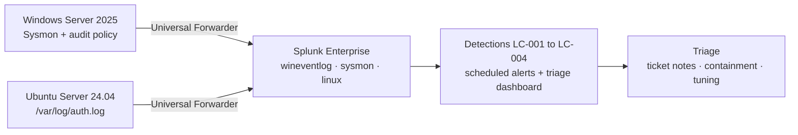

# 12 Weeks of Security Labs

Hands-on security labs built at home and documented the way I'd document work on the job: the setup, the detection logic in **SPL and KQL**, the evidence, and what I'd tune next.

All data is from my own lab. Names use the fictional company **Lab Corp**; IP addresses use documentation ranges (203.0.113.0/24, 198.51.100.0/24). No real hostnames, emails, keys or tokens.

**Start here:** [Lab 01 write-up](01-splunk-home-siem/) · [all detections](#detections-so-far) · walkthrough videos are linked in each lab as they're published.

## The lab

VMware Workstation, both VMs on an isolated NAT network with static IPs. Microsoft Sentinel and Defender XDR are added in Lab 02.

## Labs

| # | Lab | Skills shown | Status |
| --- | --- | --- | --- |
| 01 | [Splunk home SIEM](01-splunk-home-siem/) | Splunk Universal Forwarder, Sysmon, Windows and Linux logs, SPL detections, alerts, dashboard | In progress |
| 02 | [Microsoft Sentinel + Defender XDR](02-sentinel-defender/) | Sentinel analytics rules, KQL, incident handling, Defender for Endpoint response, advanced hunting | Planned |
| 03 | [GRC package](03-grc-package/) | HIPAA risk assessment, vendor risk review, risk register, control testing | Planned |
| 04 | [Same attack, two SIEMs](04-two-siems-capstone/) | Splunk vs Sentinel side by side, plus automation | Planned |

## Detections so far

| ID | Detection | MITRE ATT&CK | SPL | KQL |
| --- | --- | --- | --- | --- |
| LC-001 | Brute force / password spray | T1110.001, T1110.003 | [spl](01-splunk-home-siem/detections/spl/LC-001_bruteforce_spray.spl) | [kql](01-splunk-home-siem/detections/kql/LC-001_bruteforce_spray.kql) |
| LC-002 | Encoded / download-cradle PowerShell | T1059.001, T1027 | [spl](01-splunk-home-siem/detections/spl/LC-002_encoded_powershell.spl) | [kql](01-splunk-home-siem/detections/kql/LC-002_encoded_powershell.kql) |
| LC-003 | New local administrator | T1136.001, T1098 | [spl](01-splunk-home-siem/detections/spl/LC-003_new_local_admin.spl) | [kql](01-splunk-home-siem/detections/kql/LC-003_new_local_admin.kql) |
| LC-004 | SSH brute force (Linux) | T1110.001 | [spl](01-splunk-home-siem/detections/spl/LC-004_ssh_bruteforce.spl) | [kql](01-splunk-home-siem/detections/kql/LC-004_ssh_bruteforce.kql) |

## About me

Bernard Dorcin, Cybersecurity Engineer (Splunk SIEM triage across 12 environments; GRC in healthcare). Splunk Core Certified Power User, CompTIA Security+. [LinkedIn](https://www.linkedin.com/in/bernard-dorcin/) · [GitHub profile](https://github.com/bernarddorcin)
